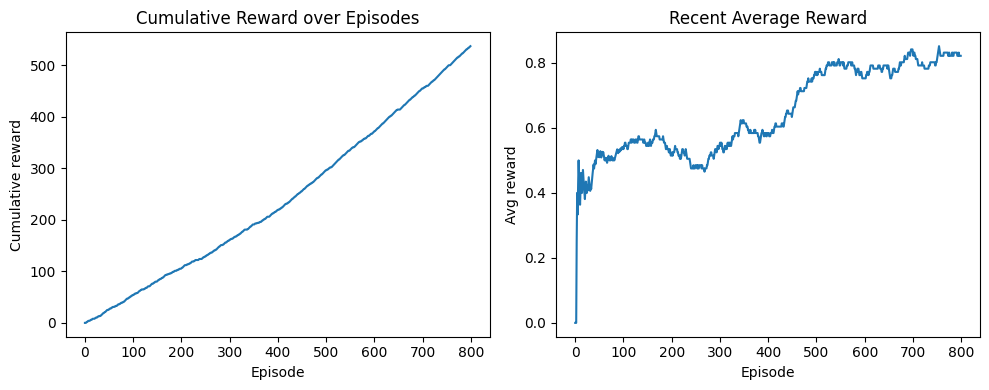
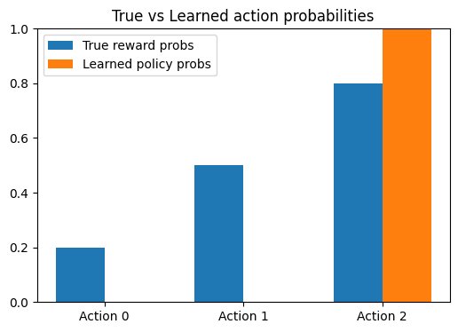

# Quantum-Reinforcement-Learning-with-Parameterized-Quantum-Policy
This project implements Quantum Reinforcement Learning (QRL) using a Parameterized Quantum Circuit (PQC) as the policy network, trained with REINFORCE and parameter-shift gradients. The agent interacts with a stochastic multi-armed bandit environment and learns to select the optimal action through quantum-classical hybrid learning.

Quantum Machine Learning (QML) often focuses on supervised tasks. This project explores Reinforcement Learning with variational quantum models, showing how PQCs can serve as policy networks and learn optimal actions from reward feedback. It aligns with modern research directions in quantum RL, variational optimization, and quantum-classical interfaces.

## Key Features
- Quantum policy network built using Qulacs (one qubit per action)
- Action probabilities generated from quantum amplitudes
- Parameter-shift gradient computation for PQC training
- REINFORCE algorithm with baseline for variance reduction
- Demonstrates complete hybrid quantum–classical RL loop
- Converges to the optimal reward-maximizing action

## How it works
1. A Parameterized Quantum Circuit (PQC) is constructed using RY rotations 
   and optional entanglement.

2. The quantum state amplitudes define a probability distribution over actions.

3. The agent interacts with a multi-armed bandit environment.

4. Rewards are used to update PQC parameters via:
      - REINFORCE policy gradients
      - Parameter-shift rule for exact differentiation

5. Over time, the quantum policy learns to choose the best action.

## Environment Description

Environment: Stochastic Multi-Armed Bandit
- Action 0 → Reward probability = 0.2
- Action 1 → Reward probability = 0.5
- Action 2 → Reward probability = 0.8 (optimal)

Goal: Learn to always select the action with highest expected reward.

# Results Summary

- Cumulative reward steadily increases → agent is improving.
- Average reward converges to ~0.8 → matches optimal arm.
- Learned action probability for action 2 approaches ~1.0.

